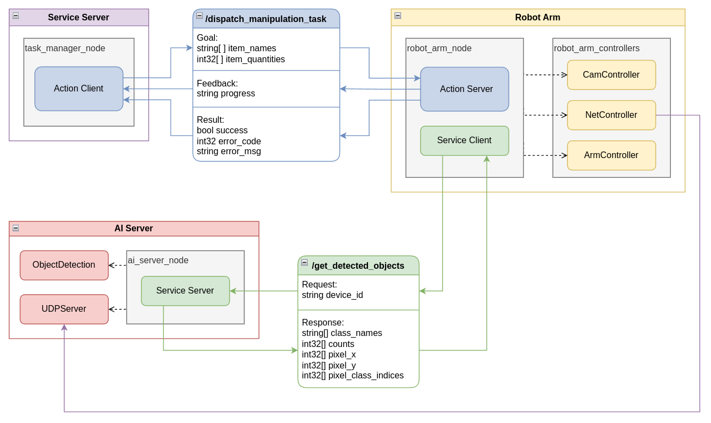

# ROS 기반 로봇 팔 자동화 프로젝트 🤖

## 📌 프로젝트 개요
이 프로젝트는 주어진 물체 목록을 기반으로 
Depth Camera를 이용해 대상 물체를 인식하고 3D 좌표를 추정한 뒤,
로봇 팔을 제어하여 지정된 위치로 물체를 이동시키는 자동화 시스템을 구축하는 것을 목표로 합니다.

## 🖼️ 시스템 구성도

## 📷 사용 장비
- RaspberryPi 4B
- [Orbbec] Astra Stereo S U3 3D Depth Camera
- 서보모터 MG996R * 6
- PCA9685 16채널 12비트 PWM 서보 드라이버

## 🚀 Getting Started
### Robot Arm
- **운영체제**: Ubuntu 20.04
- **ROS 버전**: ROS2 Humble

#### Orbbec Astra SDK 설치
https://github.com/orbbec/OrbbecSDK   
- 환경변수 설정:
```bash
export CMAKE_PREFIX_PATH=$CMAKE_PREFIX_PATH:{path_to_orbbecSDK}
export LD_LIBRARY_PATH={path_to_OrbbecSDK}/lib/arm64:$LD_LIBRARY_PATH
```

#### I2C 라이브러리 설치
```bash
sudo apt-get install -y libi2c-dev
sudo usermod -aG i2c $USER
```

#### 프로젝트 다운로드 및 빌드
```bash
git clone https://github.com/choibujang/ros_vision_arm.git
cd robot_arm
source /opt/ros/humble/setup.bash
colcon build
source install/setup.bash
```

#### 실행
```bash
ros2 run robot_arm_ros robot_arm_node
```

### AI Server
- **운영체제**: Ubuntu 20.04
- **ROS 버전**: ROS2 Humble
#### 프로젝트 다운로드 및 빌드
```bash
git clone https://github.com/choibujang/ros_vision_arm.git
cd ai_server
source /opt/ros/humble/setup.bash
colcon build
source install/setup.bash
```
#### 실행
```bash
cd cd src/ai_server_pkg/ai_server_pkg
python3 ./ai_server_node.py
```